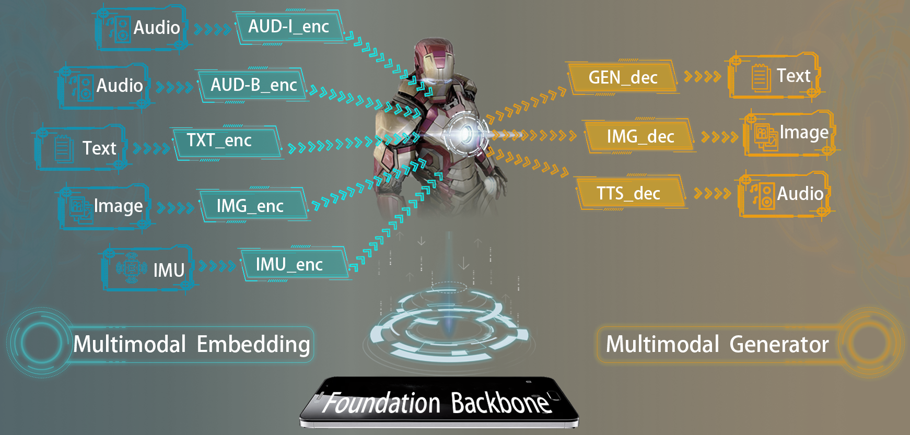

# Mobile Foundation Model as Firmware

## 1. Introduction



## 2. Running MobileFM Demo

We use the Task-21 Optical Character Recognition as an example to demonstrate the inference process of M4.

```
cd code/infer/Path-3
```

**2.1 Environment Installation:**

To install the required environment, please run

```
conda create --name path3 python=3.8 -y
conda activate path3
pip install -r requirements.txt
```

**2.2 Deploying Demo:**

Task-21 optical character recognition use `Rendered SST2` dataset.

```
python t21-rendered.py
```

## 3. Inference

The inference code for M4 on 50 tasks is stored in the `code/infer` directory. It is organized based on the underlying model into three folders: `path1`, `path2`, and `path3`. Each folder contains detailed instructions,  dependencies, and code for the inference of each task. Pretrained weights for each task are stored in the `pretrained_ckpt` path.

**Task Index**

| Path                      | Task                                                                |
| ------------------------- | --------------------------------------------------------------------|
| code/infer/path3         | T14, T15, T16, T18, ..., T31, T35, T36, T38, T39, T40, T46, T47, T48|
| code/infer/path2         | T1, T2, T3, ..., T13                                                |
| code/infer/path1         | T32, T33, T34, T37, T42, ..., T45, T49, T50                         |

<!-- 
| Path                      | Task                                        |
| ------------------------- | ------------------------------------------- |
| code/infer/ImageBind-LoRA | T21, T22, T23, T29, T35, T39, T40, T46, T47 |
| code/infer/llama-tasks    | T8                                          |
| code/infer/pandagpt-tasks | T49, T33, T34, T37                          |
-->
## 4. Benchmark Usage

## 5. Mobile Deployment

## 6. Future Work

Additional code for this project will be made available in the repository shortly. To facilitate understanding of the project, we have pre-created a file tree for the entire project. The training code will be uploaded to the `code/train` path, and the parameters for model training will be uploaded in YAML format to the `code/configs` path.
